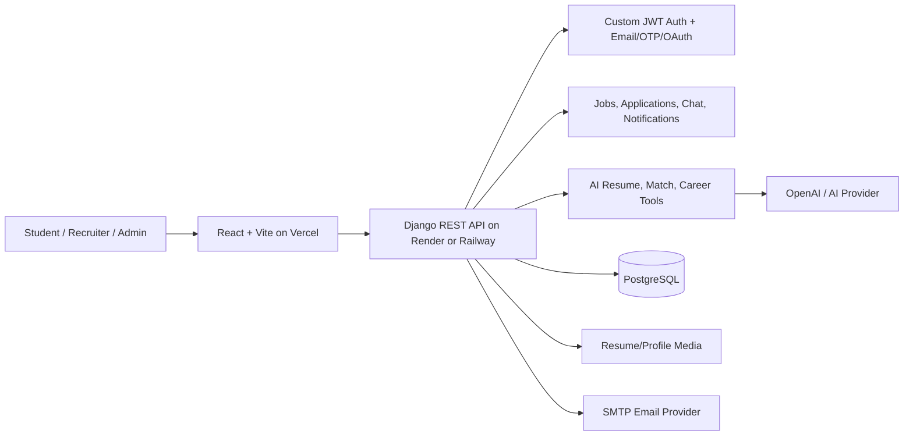

# Portfolio Presentation

## Project Title

AIJobPlatform: AI-powered job, resume, and recruiter networking platform.

## One-Line Pitch

A LinkedIn-style career platform where students upload resumes, get AI feedback, discover matched roles, and recruiters manage hiring workflows.

## Feature Showcase

- Secure role-based auth for students, recruiters, and admins.
- Resume upload with ATS scoring and AI recommendations.
- Personalized job recommendations and match scoring.
- Recruiter job posting, applicant review, and pipeline updates.
- Application tracking with status history.
- Realtime-style chat, network messages, and notifications.
- Company profiles, ratings, hiring badges, and reviews.
- Career coach tools for skill gaps, roadmaps, interviews, salary prediction, and cover letters.
- Responsive React frontend with loading skeletons, empty states, and cached API reads.
- Django backend with rate limiting, file validation, PostgreSQL deployment support, and secure production settings.

## Suggested Demo Video Flow

1. Open the landing page and show responsive navigation.
2. Sign up/login as a student.
3. Edit profile skills and links.
4. Upload a resume and show AI/ATS recommendations.
5. Browse jobs and submit an application.
6. Switch to recruiter account.
7. Post a job and review applications.
8. Show company profiles, notifications, and messaging.
9. End with architecture and deployment overview.

## Screenshots To Capture

- Landing page
- Student dashboard
- Resume upload and AI insights
- Job cards and application form
- Recruiter job posting
- Application tracking
- Company directory/profile
- Mobile view

Place images under:

```text
AIJobPlatform/docs/screenshots/
```

## Live Demo Links

- Frontend: `https://your-project.vercel.app`
- Backend API: `https://your-api.onrender.com`
- Demo video: `https://your-video-link`

## Architecture Diagram



## README Checklist

- Add live frontend URL.
- Add backend API URL.
- Add demo credentials if safe.
- Add screenshots.
- Add demo video.
- Link `API_DOCS.md`.
- Link `DEPLOYMENT.md`.
- Link this portfolio page.
